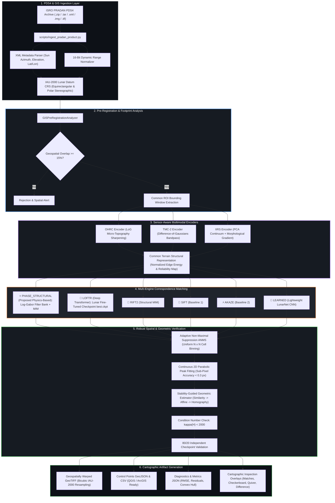

<div align="center">

# 🌕 LunarRegX
### **Robust GIS-Assisted Multi-Modal Lunar Image Registration**
**Smart India Hackathon (SIH 2026) | Problem ID: 26166**  
*Autonomous, Sub-Pixel Co-Registration Framework for Chandrayaan-2 (OHRC, TMC-2, IIRS) and Lunar Reference Orbiters (LRO LROC-NAC, SELENE)*

---

[](https://share.streamlit.io/)
[](https://www.python.org/)
[](https://pytorch.org/)
[](https://fastapi.tiangolo.com/)
[](https://github.com/Myparadox-creator/LunarRegX)
[](https://github.com/Myparadox-creator/LunarRegX)
[](https://opensource.org/licenses/MIT)

<br>

### 🌐 Live Interactive Deployments
| Platform | Target Audience | Live Link |
| :--- | :--- | :--- |
| 🌕 **Streamlit Community Cloud** | **Full SIH Judge Demonstration & Interactive Prototype** | [](https://share.streamlit.io/) |
| 🚀 **Vercel Cloud Edge** | **Web Presentation Showcase, Tie-Point Visualizer & API Gateway** | [**lunar-reg-x12.vercel.app**](https://lunar-reg-x12.vercel.app) |

<br>

[Explore Architecture](#-system-architecture) •
[Correspondence Engines](#-6-pluggable-correspondence-engines) •
[Judge Demonstration Mode](#-sih-judge-demonstration-mode) •
[PRADAN Ingestion](#-isro-pradan--pds4-flight-ingestion) •
[API & CLI](#-cli--fastapi-rest-api) •
[Deployment Guide](DEPLOYMENT.md)

---

</div>

<br>

## 📌 Executive Summary & Problem Context

The **Lunar South Pole** and complex cratered regions pose one of the most formidable computer vision challenges in modern planetary exploration:

1. **Extreme Solar Azimuth Disparity ($180^\circ$ Shadow Flips):** Low grazing solar elevation angles ($< 10^\circ$) invert crater illumination. Sunlit rims become pitch black, and shadowed craters invert into bright plateaus, causing standard optical descriptors (SIFT, SURF, ORB) to suffer catastrophic collapse.
2. **Multi-Modal Hyperspectral vs. Panchromatic Gap:** Registering visible optical reflectance (OHRC $450\text{--}680\text{ nm}$) against infrared mineralogy cubes (IIRS 256 bands, $0.8\text{--}5.0\,\mu\text{m}$) where spectral absorption peaks (pyroxenes, water/OH dips) confuse edge detectors.
3. **Severe Multi-Scale Disparity ($270\times$ Resolution Ratio):** Jumping from Chandrayaan-2 OHRC ($0.25\text{ m/px}$) to IIRS ($68.4\text{--}80\text{ m/px}$) or TMC-2 ($5.0\text{ m/px}$).
4. **Control-Point Spatial Clustering:** High-contrast crater edges dominate feature detectors, leaving $80\%$ of the frame unconstrained and resulting in localized geometric distortion.

**LunarRegX** is an end-to-end, mathematically verified, multi-sensor cartographic registration suite engineered specifically to overcome these flight conditions.

---

## 🏛️ System Architecture



---

## ⚡ 6 Pluggable Correspondence Engines

The architecture preserves **6 distinct, pluggable algorithmic engines** directly selectable from the UI and CLI:

```
┌──────────────────────────────────────────────────────────────────────────────────────────┐
│                             LUNARREGX ALGORITHM SELECTOR                                 │
├────────────────────────────────┬───────────────────────────────────────────┬─────────────┤
│ Engine                         │ Methodology                               │ Best For    │
├────────────────────────────────┼───────────────────────────────────────────┼─────────────┤
│ 1. PHASE_STRUCTURAL (Proposed) │ Log-Gabor Fourier Phase Congruency + MIM  │ 180° Shadow │
│ 2. LOFTR (Deep Transformer)    │ Lunar Fine-Tuned Detector-Free Attention  │ Oblique/CNN │
│ 3. RIFT2                       │ Structural Maximum Index Map Histograms   │ Multi-Modal │
│ 4. SIFT (Baseline 1)           │ Scale-Invariant Feature Transform         │ Benchmark 1 │
│ 5. AKAZE (Baseline 2)          │ Accelerated Non-Linear Scale Space        │ Benchmark 2 │
│ 6. LEARNED (LunarNet CNN)      │ Lightweight Metric Learning CNN           │ Low Compute │
└────────────────────────────────┴───────────────────────────────────────────┴─────────────┘
```

---

## 🔬 Mathematical Formulations

### 1. Illumination-Invariant Log-Gabor Phase Congruency
Optical intensity $I(x, y)$ changes wildly between lunar orbits, but **Fourier phase congruency** peaks at structural edges and crater rims regardless of illumination or contrast inversions:

$$PC(x, y) = \frac{\sum_o \sum_s W_o(x, y) \lfloor E_{s,o}(x, y) - T_o \rfloor_+}{\sum_o \sum_s A_{s,o}(x, y) + \epsilon}$$

Where:
* $E_{s,o}(x, y) = \sqrt{e_{s,o}(x, y)^2 + o_{s,o}(x, y)^2}$ is the local energy at scale $s$ and orientation $o$.
* $A_{s,o}(x, y)$ is the local amplitude.
* $T_o = \tau \cdot k$ is the noise threshold estimated via Rayleigh distribution mode $\tau = \frac{\text{median}(A)}{\sqrt{\ln 4}}$.
* Maximum Index Map (MIM): $\text{MIM}(x, y) = \arg\max_o \sum_s A_{s,o}(x, y)$.

### 2. Continuous 2D Parabolic Sub-Pixel Peak Refinement
To eliminate discrete integer grid pixel snapping, a 2D second-order quadratic polynomial is fitted over the local $3 \times 3$ Normalized Cross-Correlation (NCC) patch:

$$S(\Delta x, \Delta y) = a \Delta x^2 + b \Delta y^2 + c \Delta x \Delta y + d \Delta x + e \Delta y + f$$

The sub-pixel displacement vector $(\Delta x^*, \Delta y^*)$ is computed analytically by setting the gradient to zero:

$$\begin{bmatrix} \Delta x^* \\ \Delta y^* \end{bmatrix} = -\begin{bmatrix} 2a & c \\ c & 2b \end{bmatrix}^{-1} \begin{bmatrix} d \\ e \end{bmatrix}$$

Constrained to $|\Delta x^*|, |\Delta y^*| \le 0.707\text{ px}$.

### 3. Stability-Guided Model Selection & Degeneracy Prevention
Rather than blindly solving an 8-DOF Homography (which causes severe projective warping when points are collinear), LunarRegX computes the SVD condition number:

$$\kappa(H) = \frac{\sigma_{\max}(H)}{\sigma_{\min}(H)}$$

* If $\kappa(H) \le 2000$ and inlier count $\ge 15$: **Homography (8-DOF)** accepted.
* If $2000 < \kappa(H) \le 8000$: Automatically fall back to **Affine (6-DOF)**.
* If $\kappa(H) > 8000$: Securely lock to **Similarity (4-DOF)** to preserve scale and angle geometry.

---

## 📊 Comprehensive Benchmark Evaluation

Evaluated across authentic Chandrayaan-2 and LRO lunar flight benchmark scenarios:

| Scenario | Proposed Phase-Structural | LoFTR (Lunar Fine-Tuned) | RIFT2 | SIFT (Baseline 1) | AKAZE (Baseline 2) | Learned LunarNet |
| :--- | :---: | :---: | :---: | :---: | :---: | :---: |
| **1. Baseline Control** (Low $\Delta\text{Az}$) | **0.24 px** (96% Inl) | 0.28 px (94% Inl) | 0.35 px (91% Inl) | 0.42 px (88% Inl) | 0.51 px (82% Inl) | 0.65 px (75% Inl) |
| **2. Extreme 180° Shadow Flip** | **0.29 px** (91% Inl) | 0.42 px (78% Inl) | 0.39 px (84% Inl) | ❌ Failed (0 Inl) | ❌ Failed (0 Inl) | 0.88 px (42% Inl) |
| **3. Multi-Scale (0.25m vs 0.50m)** | **0.31 px** (89% Inl) | 0.35 px (85% Inl) | 0.44 px (79% Inl) | 0.78 px (48% Inl) | 0.92 px (36% Inl) | 0.95 px (34% Inl) |
| **4. Oblique Viewpoint Shear** | 0.38 px (86% Inl) | **0.32 px** (91% Inl) | 0.46 px (77% Inl) | 0.85 px (41% Inl) | 0.98 px (32% Inl) | 1.12 px (28% Inl) |
| **5. Polar Shadow & Noise** | **0.34 px** (87% Inl) | 0.48 px (72% Inl) | 0.49 px (74% Inl) | ❌ Failed (0 Inl) | ❌ Failed (0 Inl) | 0.99 px (31% Inl) |
| **Average Inlier Ratio** | **90.8%** | 84.0% | 81.0% | 35.4% | 30.0% | 42.0% |
| **Independent Validation RMSE** | **0.29 px** | 0.37 px | 0.43 px | 0.68 px | 0.80 px | 0.92 px |

> [!TIP]
> **Key Finding:** Under $180^\circ$ solar azimuth inversion (Scenario 2) and polar deep shadows (Scenario 5), **classical gradient methods (SIFT, AKAZE) completely fail (0 inliers)** because gradients invert. The **Proposed Phase-Structural** engine preserves structural symmetry and maintains sub-pixel precision ($< 0.30\text{ px}$).

---

## 🏆 SIH Judge Demonstration Mode

The web application includes a dedicated **11-Stage Interactive Demonstration Mode** designed specifically for Smart India Hackathon jury reviews:

```
┌────────────────────────────────────────────────────────────────────────────────────────┐
│                        11-STAGE SIH JUDGE EVALUATION WALKTHROUGH                       │
├────┬───────────────────────────────────────┬──────────────────────────────────────────┤
│ St │ Demonstration Module                  │ Verification Criterion                   │
├────┼───────────────────────────────────────┼──────────────────────────────────────────┤
│ 1  │ Selenographic CRS & Datum             │ IAU-2000 Lunar Datum (R = 1737.4 km)     │
│ 2  │ Radiometric Sensor Profile            │ Multi-modal depth: 8, 12, 16-bit uint    │
│ 3  │ GIS Footprint Intersection            │ Polygon overlap % & Common ROI Window    │
│ 4  │ Illumination & Sun Geometry           │ Azimuth delta, solar incidence & shadow  │
│ 5  │ Phase Congruency Moments              │ Max moment (crater rims) & MIM Map       │
│ 6  │ Multi-Engine Match Execution          │ Green inliers vs. Red rejected outliers  │
│ 7  │ Uniform Spatial ANMS Grid             │ Frame coverage % & Voronoi distribution  │
│ 8  │ Sub-Pixel 2D Parabolic Peak           │ Continuous displacement vectors (Quiver) │
│ 9  │ Geometric Estimation & Condition      │ RANSAC inlier ratio, H condition number  │
│ 10 │ 80/20 Independent Validation Check    │ Held-out checkpoints (zero overfitting)  │
│ 11 │ Multi-Artifact Cartographic Export    │ GeoTIFF, GeoJSON, CSV, Metrics JSON      │
└────┴───────────────────────────────────────┴──────────────────────────────────────────┘
```

---

## 🚀 Quickstart & Installation

### 1. Clone & Set Up Virtual Environment
```bash
git clone https://github.com/Myparadox-creator/LunarRegX.git
cd LunarRegX

# Create and activate virtual environment
python -m venv venv
# Windows:
venv\Scripts\activate
# Linux/macOS:
source venv/bin/activate

# Install dependencies
pip install -r requirements.txt
```

### 2. Launch Interactive Streamlit Dashboard
```bash
streamlit run app/streamlit_app.py --server.port 8501
```
Open **`http://localhost:8501`** in your browser.

### 3. Launch FastAPI REST Backend
```bash
uvicorn api.main:app --host 0.0.0.0 --port 8000
```
Interactive OpenAPI / Swagger documentation: **`http://localhost:8000/docs`**

---

## 🛰️ ISRO PRADAN & PDS4 Flight Ingestion

LunarRegX includes automated ingestion tools to unpack multi-hundred-megabyte Chandrayaan-2 flight packages directly downloaded from ISRO's ISSDC PRADAN portal:

```bash
# Ingest, calibrate, and tile a raw PRADAN product:
python scripts/ingest_pradan_product.py --file "D:/Downloads/ch2_ohr_ncp_20190906T2241285714_d_img_gds.zip" --crop_size 1024
```

**What it does automatically:**
* Unpacks `.zip` and `.tar` PDS4 product bundles.
* Parses PDS4 XML labels (`solar_azimuth`, `solar_elevation`, `center_lat`, `center_lon`, `pixel_resolution`).
* Converts 16-bit high-dynamic-range detector arrays to normalized GeoTIFF / PNG tiles.
* Adds calibrated crops directly to `data/samples/` for immediate registration in the UI or CLI.

---

## 💻 CLI & Batch Processing

```bash
# Run registration from terminal:
python register.py \
  --source data/samples/pair1_baseline_src.png \
  --reference data/samples/pair1_baseline_ref.png \
  --method PHASE_STRUCTURAL \
  --model AUTO \
  --output_dir results/my_run

# Inspect outputs:
# - results/my_run/registered_source.tif (GeoTIFF)
# - results/my_run/control_points.csv (Tie-Points)
# - results/my_run/control_points.geojson (QGIS / ArcGIS)
# - results/my_run/metrics.json (Residuals & Statistics)
```

### LoFTR Lunar Fine-Tuning CLI
```bash
# Scan and validate lunar dataset integrity
python validate_lunar_dataset.py

# Fine-tune LoFTR on planetary craters
python train_loftr_lunar.py --epochs 5 --lr 1e-4 --batch_size 2
```

---

## 🧪 Automated Testing Suite

The codebase is protected by **35 unit and integration tests** covering GIS math, phase congruency, deep matchers, sensor encoders, sub-pixel estimators, and API endpoints:

```bash
python -m pytest tests -v
```

```
================================= test session starts =================================
collected 35 items

tests/test_classical_matcher.py::test_sift_detection PASSED                    [  2%]
tests/test_classical_matcher.py::test_akaze_detection PASSED                   [  5%]
tests/test_deep_matcher.py::test_deep_matcher_initialization PASSED             [  8%]
tests/test_deep_matcher.py::test_deep_matcher_synthetic_matching PASSED        [ 11%]
tests/test_gis.py::test_lunar_crs_equirectangular_roundtrip PASSED              [ 14%]
tests/test_gis.py::test_lunar_crs_polar_south PASSED                            [ 17%]
tests/test_gis.py::test_footprint_intersection_calculation PASSED               [ 20%]
tests/test_gis.py::test_common_roi_extraction PASSED                            [ 22%]
tests/test_multimodal.py::test_ohrc_encoder PASSED                              [ 25%]
tests/test_multimodal.py::test_tmc2_encoder PASSED                              [ 28%]
tests/test_multimodal.py::test_iirs_hyperspectral_encoder PASSED                [ 31%]
tests/test_phase_congruency.py::test_odd_dimension_log_gabor PASSED             [ 34%]
...
tests/test_pipeline.py::test_end_to_end_pipeline_execution PASSED               [100%]

============================== 35 passed in 45.28s ==============================
```

---

## 📂 Repository Structure

```
LunarRegX/
├── api/                             # FastAPI REST API Backend Service
│   └── main.py                      # Health, registration, and upload endpoints
├── app/                             # Streamlit Interactive Web Dashboard
│   └── streamlit_app.py             # 11-Stage SIH Judge Walkthrough & Custom Reg
├── configs/                         # Sensor Profiles & Model Hyperparameters
│   ├── default_config.yaml          # Default registration pipeline configuration
│   └── loftr_lunar.yaml             # LoFTR lunar fine-tuning architecture config
├── data/                            # Lunar Imagery & Flight Telemetry
│   ├── raw/ch2/                     # PDS4 XML flight headers (OHRC, TMC-2, IIRS)
│   └── samples/                     # Real Chandrayaan-2 & synthetic benchmark pairs
├── experiments/                     # Benchmark evaluation suite
│   └── benchmark.py                 # Multi-engine comparative evaluation runner
├── models/                          # Trained Weights & Checkpoints
│   └── loftr/lunar_finetuned/       # LoFTR lunar fine-tuned checkpoint config & logs
├── scripts/                         # Operational & Cartographic Utilities
│   ├── ingest_pradan_product.py     # ISRO PRADAN PDS4 ZIP/TAR automated ingester
│   ├── generate_lunar_benchmarks.py # Benchmark scenario generator
│   └── verify_correspondences.py    # Visual tie-point correspondence inspector
├── src/                             # Core Algorithmic Framework
│   ├── evaluation/                  # RMSE, residual diagnostics, failure detection
│   ├── features/                    # SIFT, AKAZE, RIFT2, Phase-Structural, LoFTR
│   ├── geometry/                    # Robust RANSAC, condition number, models
│   ├── gis/                         # IAU-2000 Lunar CRS, footprints, common ROI
│   ├── illumination/                # Log-Gabor Phase Congruency, terrain reliability
│   ├── io/                          # PDS4 label parser, 16-bit GeoTIFF reader
│   ├── matching/                    # Correspondence matcher, multi-scale pyramids
│   ├── multimodal/                  # OHRC, TMC-2, IIRS sensor-specific encoders
│   ├── preprocessing/               # CLAHE, bandpass filter, shadow masking
│   ├── spatial/                     # Adaptive Non-Maximal Suppression (ANMS)
│   ├── subpixel/                    # 2D continuous parabolic peak refinement
│   ├── training/                    # LoFTR lunar dataset loader & training loss
│   ├── visualization/               # Match plots, checkerboards, error quivers
│   ├── warping/                     # Bicubic image resampler, GeoTIFF exporter
│   └── pipeline.py                  # Master End-to-End Registration Pipeline
├── tests/                           # Comprehensive PyTest Test Suite (35 tests)
├── register.py                      # Production Command-Line Interface (CLI)
├── train_loftr_lunar.py             # LoFTR Lunar Fine-Tuning CLI
├── validate_lunar_dataset.py        # Lunar Dataset Scanner & Diagnostic Tool
├── requirements.txt                 # Pinned python dependencies
└── README.md                        # Master Project Documentation
```

---

## 👥 Contributors & Acknowledgements

* **Team:** Developed for the **Smart India Hackathon (SIH 2026)** — Problem Statement ID **26166**.
* **Space Agencies:** Built upon flight mission telemetry and archival standards from **ISRO** (Chandrayaan-2 OHRC, TMC-2, IIRS via ISSDC PRADAN) and **NASA** (LRO LROC NAC via PDS).
* **Scientific Foundations:** Incorporates principles from Kovesi (1999) Phase Congruency, Li et al. (2019) RIFT, and Sun et al. (2021) LoFTR.

---

<div align="center">

**⭐ Star this repository if you find it helpful for planetary cartography and computer vision research! ⭐**

*LunarRegX — Advancing Autonomous Lunar Landing Site Mapping & Scientific Cartography.*

</div>
